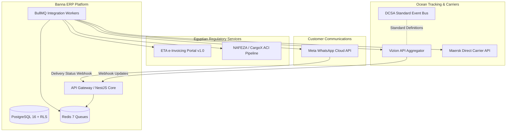

# 🌐 Banna ERP — Enterprise Integrations Specification & Architecture Guide
**Document Version:** 1.0 (Production Blueprint)  
**Target Platform:** Banna Logistics & Freight Forwarding ERP / CRM  
**Maintainer:** Principal Systems Architect & Engineering Team  

---

## 1. Executive Integration Architecture Overview

Banna ERP connects to external ecosystems across three critical domains:
1. **Government & Regulatory Compliance (Egypt)**: Real-time tax invoice transmission (ETA e-Invoicing) and customs cargo clearance (NAFEZA/CargoX ACI).
2. **Carrier & Freight Visibility (Global Ocean)**: Container milestone tracking, vessel AIS schedules, and port terminal events (DCSA Standard, Vizion API, Maersk API).
3. **Direct Customer & Partner Communication**: Automated notifications, document dispatch, and demurrage alerts (Meta WhatsApp Cloud API).



---

## 2. 🇪🇬 Egyptian Tax Authority (ETA) — e-Invoicing Integration

### 2.1 Official Specification Links & SDK
* **Main Portal SDK**: [https://sdk.sit.invoicing.eta.gov.eg/](https://sdk.sit.invoicing.eta.gov.eg/)
* **API Documentation**: [https://sdk.sit.invoicing.eta.gov.eg/api/](https://sdk.sit.invoicing.eta.gov.eg/api/)
* **eInvoicing APIs Specification**: [https://sdk.sit.invoicing.eta.gov.eg/einvoicingapi/](https://sdk.sit.invoicing.eta.gov.eg/einvoicingapi/)
* **Document Submission Guide**: [https://sdk.sit.invoicing.eta.gov.eg/einvoicingapi/01-submit-documents/](https://sdk.sit.invoicing.eta.gov.eg/einvoicingapi/01-submit-documents/)
* **Environments & FAQ**: [https://sdk.sit.invoicing.eta.gov.eg/faq/](https://sdk.sit.invoicing.eta.gov.eg/faq/)

### 2.2 Integration Architecture & Security
* **Authentication**: Identity Provider (IdS) OAuth 2.0 Client Credentials Grant (`client_id` + `client_secret`) returning a Bearer token valid for 3600 seconds.
* **Document Signing**: Invoices must be canonicalized and signed using CAdES-BES (E-Token / HSM physical hardware or cloud KMS with Egyptian PKI certificates from Egypt Trust or Misr Sign).
* **Document Types**:
  * `I` = Invoice (فاتورة ضريبية)
  * `C` = Credit Note (إشعار دائن)
  * `D` = Debit Note (إشعار مدين)
* **Tax Details**: Egyptian VAT (T1: Value Added Tax - standard 14%) applied on Freight, Port charges, and Clearance agency fees.
* **Item Coding**: Standard EGS (Egyptian Goods & Services) with prefix `EG-<CompanyTaxID>-<ItemCode>` or GS1 GTIN codes mapped to GPC bricks.

### 2.3 Key API Endpoints
| Action | Method | Pre-Production (SIT) Endpoint | Production Endpoint |
| :--- | :--- | :--- | :--- |
| **Get Access Token** | `POST` | `https://id.sit.eta.gov.eg/connect/token` | `https://id.eta.gov.eg/connect/token` |
| **Submit Documents** | `POST` | `https://api.sit.invoicing.eta.gov.eg/api/v1.0/documentsubmissions` | `https://api.invoicing.eta.gov.eg/api/v1.0/documentsubmissions` |
| **Get Document Status**| `GET`  | `https://api.sit.invoicing.eta.gov.eg/api/v1.0/documents/{uuid}/raw` | `https://api.invoicing.eta.gov.eg/api/v1.0/documents/{uuid}/raw` |
| **Print PDF / Public** | `GET`  | `https://api.sit.invoicing.eta.gov.eg/api/v1.0/documents/{uuid}/pdf` | `https://api.invoicing.eta.gov.eg/api/v1.0/documents/{uuid}/pdf` |

---

## 3. 🚢 DCSA (Digital Container Shipping Association) — Track & Trace Standard

### 3.1 Official Specification Links & Guides
* **Track & Trace Standard Documentation**: [https://dcsa.org/standards/track-and-trace/standard-documentation-track-and-trace](https://dcsa.org/standards/track-and-trace/standard-documentation-track-and-trace)
* **Track & Trace Overview**: [https://dcsa.org/standards/track-and-trace](https://dcsa.org/standards/track-and-trace)
* **Track & Trace Implementation Guide**: [https://reference.dcsa.org/content/standards/guidelines/implementation-guides/implementing-track-and-trace](https://reference.dcsa.org/content/standards/guidelines/implementation-guides/implementing-track-and-trace)
* **DCSA Implementation Guides Repository**: [https://reference.dcsa.org/content/standards/guidelines/implementation-guides](https://reference.dcsa.org/content/standards/guidelines/implementation-guides)

### 3.2 Standard Domain Model Adopted in Banna ERP
DCSA establishes the unified event terminology that Banna ERP uses internally across all carriers:
* **Event Classifiers**:
  * `ACT` (Actual) — Real event recorded by terminal or vessel.
  * `EST` (Estimated) — Dynamic ETA/ETD projection.
  * `PLN` (Planned) — Booking schedule baseline.
* **Event Types**:
  1. `SHIPMENT` (Booking, Bill of Lading issue, Customs Release).
  2. `TRANSPORT` (Vessel Departure, Arrival, Berth, Discharge).
  3. `EQUIPMENT` (Empty container gate-out, Load on board, Discharge, Gate-in terminal, Empty return).

---

## 4. 📦 Vizion API — Multi-Carrier Automated Tracking

### 4.1 Official Specification Links
* **API Reference**: [https://docs.vizionapi.com/reference/introduction](https://docs.vizionapi.com/reference/introduction)
* **Quick Start Guide**: [https://docs.vizionapi.com/docs/quick-start](https://docs.vizionapi.com/docs/quick-start)
* **Input Tracking Options**: [https://docs.vizionapi.com/docs/input-options](https://docs.vizionapi.com/docs/input-options)
* **Webhooks & Update Payloads**: [https://docs.vizionapi.com/docs/understand-update-payload](https://docs.vizionapi.com/docs/understand-update-payload)

### 4.2 Integration Workflow in Banna ERP
1. **Container Enrollment**: When a Shipment Job File is created with a Master Bill of Lading (MBL) or Container ID:
   ```http
   POST https://api.vizionapi.com/v2/references
   X-API-Key: {{VIZION_API_KEY}}
   Content-Type: application/json

   {
     "container_id": "MSCU7829104",
     "scac": "MSCU",
     "callback_url": "https://api.banna-logistics.com/api/v1/webhooks/vizion"
   }
   ```
2. **Webhook Ingestion**: Vizion pushes real-time normalized milestones (ETA updates, discharge timestamps, terminal dwell alerts) directly to our NestJS webhook controller.
3. **Demurrage Engine Trigger**: On `discharged` event, Banna automatically starts the countdown for the client's `free_days_allowed` (e.g., 14 days) and triggers warnings when ≤ 3 days remain.

---

## 5. 🚢 Maersk Developer API — Direct Carrier Integration

### 5.1 Official Specification Links
* **Maersk Developer Portal**: [https://developer.maersk.com/](https://developer.maersk.com/)
* **Support & FAQs**: [https://developer.maersk.com/support/faqs](https://developer.maersk.com/support/faqs)

### 5.2 Available Capabilities for Banna Logistics
* **Tracking API**: Real-time status for Maersk, Safmarine, and Sealand bookings and equipment.
* **Schedules & Point-to-Point API**: Search vessel transit times between global ports (e.g., Shanghai CNSHA to Alexandria EGALY).
* **Direct Booking Submissions**: Submit shipping instructions and verify Sea Waybills directly from Banna ERP.
* **Authentication**: OAuth 2.0 with Maersk Consumer Key and Secret.

---

## 6. 📱 Meta WhatsApp Cloud API — Customer Milestone Messaging

### 6.1 Official Specification Links
* **Official Documentation**: [https://developers.facebook.com/docs/whatsapp/cloud-api/](https://developers.facebook.com/docs/whatsapp/cloud-api/)
* **Cloud API Architecture Overview**: [https://developers.facebook.com/docs/whatsapp/cloud-api/overview](https://developers.facebook.com/docs/whatsapp/cloud-api/overview)

### 6.2 Implementation Details in Banna ERP
* **Direct Meta Connection**: Direct Graph API v19.0+ without intermediary brokers (lower latency, 0% third-party message markup fee).
* **Approved Message Templates**:
  1. `quotation_ready_v1`: Sends interactive PDF quote link to client with Accept/Negotiate action buttons.
  2. `shipment_milestone_update`: Triggered when container arrives at destination port or clears customs.
  3. `acid_expiry_warning`: Alerts import manager when NAFEZA ACID has 15 days or less remaining before cargo shipment.
  4. `demurrage_critical_alert`: High-priority alert when container free days are within 48 hours.

---

## 7. 🇪🇬 NAFEZA / CargoX Integration Architecture

### 7.1 Engineering Assessment
As verified by our Principal Architect, NAFEZA (MTS Egypt) and CargoX do not provide an open, public self-serve OpenAPI specification for public developers. Integration is gated behind corporate company account verification and accredited Egyptian customs broker tokens.

### 7.2 The Banna "Adapter Pattern" Solution
To provide immediate production value without waiting for slow government API approvals:
1. **Core ACID Management Engine**:
   * Validates Egyptian 19-digit ACID format: `^[0-9]{19}$`.
   * Computes official 90-day validity window (`valid_from` to `valid_until`).
   * Tracks Certificate 46 (رقم الشهادة الجمركية 46) and customs status progression.
2. **Direct B2B Gateway Interface**:
   * Designed with an abstracted `INafezaService` provider interface.
   * Enables seamless drop-in of the private CargoX B2B API keys / SFTP file exchange once issued to the company, with Zero breaking changes to the core ERP.

---

## 8. Summary of Required Production Environment Variables

```env
# ==========================================
# 1. Egyptian Tax Authority (ETA eInvoicing)
# ==========================================
ETA_ENV=sit # or production
ETA_CLIENT_ID=your_company_eta_client_id
ETA_CLIENT_SECRET=your_company_eta_client_secret
ETA_COMPANY_TAX_ID=928182441
ETA_TOKEN_PIN=12345678 # for USB hardware token signing

# ==========================================
# 2. Ocean Tracking (Vizion & Maersk)
# ==========================================
VIZION_API_KEY=vz_live_xxxxxxxxxxxxxxxxxxxxxxxx
MAERSK_CONSUMER_KEY=maersk_api_key_xxxxxxxxxx
MAERSK_CONSUMER_SECRET=maersk_secret_xxxxxxxx

# ==========================================
# 3. Meta WhatsApp Cloud API
# ==========================================
META_WA_PHONE_NUMBER_ID=109283746501928
META_WA_ACCESS_TOKEN=EAABxxxxxxxxxxxxxxxxxxxxxxxx
META_WA_WEBHOOK_VERIFY_TOKEN=banna_wa_secure_verify_2026

# ==========================================
# 4. Storage (Cloudflare R2 for PDFs & Documents)
# ==========================================
R2_ACCOUNT_ID=xxxxxxxxxxxxxxxxxxxxxxxxxxxxxxxx
R2_ACCESS_KEY_ID=xxxxxxxxxxxxxxxxxxxxxxxxxxxxxxxx
R2_SECRET_ACCESS_KEY=xxxxxxxxxxxxxxxxxxxxxxxxxxxxxxxx
R2_BUCKET_NAME=banna-production-documents
```
