# 🌐 دورة حياة النظام ومعمارية تدفق البيانات الكاملة — Red Shipping ERP
## Complete End-to-End System Lifecycle & Data Propagation Guide

> **تاريخ التحديث والتحقق:** 2026-09-24  
> **حالة النظام:** تم فحص كافة الـ Queries ومطابقة الـ Wiring وحذف أي Mockup Data وإصلاح ملفات التخليص الجمركي والـ API بنجاح (TypeScript 0 Errors في Frontend و Backend).

---

## 📌 الفهرس العام
1. [المبدأ المعماري الحاكم: Multi-Tenancy وعزل البيانات](#1-المبدأ-المعماري-الحاكم-multi-tenancy-وعزل-البيانات)
2. [دليل السجلات الرئيسية (Masters) وكيف تتصل بباقي النظام](#2-دليل-السجلات-الرئيسية-masters-وكيف-تتصل-بباقي-النظام)
3. [الدورة التشغيلية الكاملة خطوة بخطوة (من البداية للنهاية)](#3-الدورة-التشغيلية-الكاملة-خطوة-بخطوة)
   - الخطوة 1: العميل المحتمل والـ CRM
   - الخطوة 2: التسعير وعرض السعر (Quotation)
   - الخطوة 3: ملف الشحنة التشغيلي (Shipment Job File)
   - الخطوة 4: التخليص الجمركي ومنظومة نافذة ACI
   - الخطوة 5: النقل البري وتوجيه الشاحنات (Dispatch & Fleet)
   - الخطوة 6: الفواتير وسندات الصرف والربحية (P&L & Accounting)
4. [أين "تسمع" البيانات؟ (Data Propagation Matrix)](#4-أين-تسمع-البيانات-data-propagation-matrix)
5. [أبرز المشاكل التي تم اكتشافها وحلها في هذا الفحص](#5-أبرز-المشاكل-التي-تم-اكتشافها-وحلها)

---

## 1. المبدأ المعماري الحاكم: Multi-Tenancy وعزل البيانات

* **`companyId` (Tenant ID):**  
  كل جدول في قاعدة البيانات (PostgreSQL عبر Prisma) مرتبط بـ `companyId` لضمان عزل البيانات بين الشركات والمقرات المختلفة.
* **كيف يتم استخراج الـ Tenant؟**  
  عند تسجيل الدخول (`POST /auth/login`)، يُصدر السيرفر `JWT Token` يحتوي على `companyId` و `sub` (User ID).  
  كل طلب قادم من الـ Frontend يمر عبر Decorator `@TenantId()` في الـ Controller، فيُحقن الـ `companyId` تلقائياً في استعلامات Prisma (`where: { companyId }`).
* **انعدام البيانات الوهمية (No Mockups):**  
  جميع شاشات النظام تعتمد على استعلامات حية (`GET /api/v1/...`)، وفي حالة عدم وجود سجلات تعرض الشاشات `EmptyState` أنيقة ونظيفة بدون أي داتا مصطنعة.

---

## 2. دليل السجلات الرئيسية (Masters) وكيف تتصل بباقي النظام

السجلات الرئيسية هي حجر الأساس الذي تتغذى عليه كافة العمليات:

```mermaid
graph TD
    Ports["1. دليل الموانئ والمنافذ (Ports)"] -->|POL / POD| Quotations["عروض الأسعار"]
    Ports -->|POL / POD| Shipments["ملفات الشحن"]
    Ports -->|جمرك الوصول| Customs["التخليص الجمركي"]

    ShippingLines["2. الخطوط الملاحية (Shipping Lines)"] -->|Carrier| Shipments
    ShippingLines -->|Booking & Freight| Invoices["فواتير النولون"]
    ShippingLines -->|D&D Tariffs| Tools["حاسبة غرامات التأخير D&D"]

    OverseasAgents["3. الوكلاء الخارجيون (Overseas Agents)"] -->|FOB / EXW Agent| Shipments
    OverseasAgents -->|Profit Share / Debit| Disbursements["سندات الصرف والتحويل"]

    Vendors["4. الموردون والمتعهدون (Vendors)"] -->|مقاولو النقل| Dispatch["إدارة النقل البري"]
    Vendors -->|مصاريف ومستحقات| Costs["تكاليف الشحنة P&L"]

    ChargeItems["5. بنود الرسوم والخدمات (Charge Items)"] -->|بنود التسعير| Quotations
    ChargeItems -->|بنود الفاتورة| Invoices
    ChargeItems -->|بنود الصرف| Disbursements

    Drivers["6. سجل السائقين والشاحنات (Fleet / Drivers)"] -->|تعيين السائق| Dispatch
```



| السجل الرئيسي (Master) | الجدول في DB | الـ API Endpoint | أين يغذي في النظام؟ |
|---|---|---|---|
| **الموانئ (Ports)** | `ports` | `GET /masters/ports` + `GET /maritime/ports` | • اختيار موانئ الشحن والتفريغ في الشحنات وعروض الأسعار<br>• جمرك الإفراج في التخليص الجمركي<br>• محدد خطوط الملاحة وحساب المسافات البحرية |
| **الخطوط الملاحية (Shipping Lines)** | `shipping_lines` | `GET /masters/shipping-lines` | • ربط الشحنة بالتوكيل الملاحي (MSC, Maersk, CMA CGM...)<br>• تتبع البوليصة عبر بوابات الخطوط الملاحية الرسمية<br>• حساب فترات السماح وغرامات الأرضيات |
| **الوكلاء الخارجيون (Overseas Agents)** | `overseas_agents` | `GET /masters/overseas-agents` | • تنسيق شحنات الـ FOB / EXW في موانئ الصين وأوروبا<br>• تسوية حصص الأرباح والمصروفات بالعملات الأجنبية |
| **دليل الموردين (Vendors)** | `vendors` | `GET /masters/vendors` | • مقاولو النقل بالسيارات، مكاتب التخليص، شركات التخزين والتبخير<br>• سداد سندات الصرف التشغيلية |
| **بنود الرسوم (Charge Items)** | `charge_items` | `GET /masters/charge-items` | • توحيد أسماء الرسوم في عروض الأسعار وفواتير العملاء وتكاليف الشحن |
| **السائقون والشاحنات (Drivers & Trucks)** | `drivers` / `vendors` | `GET /masters/drivers` | • تعيين السائق ورقم اللوحة وإذن الشحن في لوحة النقل البري |

---

## 3. الدورة التشغيلية الكاملة خطوة بخطوة

```
[1. CRM Lead] ──> [2. Quotation] ──> [3. Shipment Job] ──> [4. Customs Dossier] ──> [5. Dispatch Trip] ──> [6. Invoice & Settlement]
```

### الخطوة 1️⃣: العميل المحتمل والـ CRM (Prospect → Client)
* **المسار في الواجهة:** `/crm` و `/clients`
* **الجدول:** `clients` و `client_contacts` و `crm_activities`
* **ماذا يحدث؟**
  1. يُسجل العميل المحتمل بحالة `status = 'prospect'`.
  2. يتم توثيق الاتصالات والاجتماعات في `crm_activities`.
  3. بمجرد تأكيد أول عملية، يتحول العميل تلقائياً إلى `active` ويصبح متاحاً لإصدار الشحنات والفواتير.

### الخطوة 2️⃣: التسعير وعرض السعر (Quotation & Tariff Matrix)
* **المسار في الواجهة:** `/quotations` و `/pricing`
* **الجدول:** `quotations` و `quotation_items`
* **الربط بالماسترز:**
  - `clientId` ➔ جدول `clients`
  - `originPortId` / `destinationPortId` ➔ جدول `ports`
  - `chargeItemId` ➔ جدول `charge_items`
* **ماذا يحدث؟**
  - يتم حساب تكلفة الشحن (Buy Rate) وسعر البيع للعميل (Sell Rate) وهامش الربح المتوقع.
  - عند قبول العميل للعرض (`status = 'accepted'`)، يمكن نقله مباشرة لإنشاء ملف شحنة تنفيذي.

### الخطوة 3️⃣: ملف الشحنة التشغيلي (Shipment Job File — قلب العمليات)
* **المسار في الواجهة:** `/shipments` و `/shipments/:id`
* **الجدول:** `shipments` و `containers` و `shipment_events`
* **الرقم المرجعي:** تسلسل قياسي معتمد `BAN-YYYY-NNNN`
* **الربط المباشر:**
  - العميل (`clientId`)
  - الخط الملاحي (`shippingLineId`)
  - الوكيل الخارجي (`overseasAgentId`)
  - موانئ الانطلاق والوصول (`originPortId`, `destinationPortId`)
* **آلية التسميع:**
  - يتم إنشاء الحاويات المرتبطة في جدول `containers` (رقم الحاوية، النوع 40HQ/20GP، وزن VGM، رقم السيل).
  - عند تغيير المرحلة التشغيلية (`currentStage`)، يُسجل حدث تلقائي في `shipment_events` ويُطلق Event `shipment.stage.changed` لإنشاء إشعارات في جدول `notifications`.

### الخطوة 4️⃣: التخليص الجمركي ومنظومة نافذة (Customs Dossier & NAFEZA ACI)
* **المسار في الواجهة:** `/customs` و `/customs/:id`
* **الجدول:** `customs_dossiers` (علاقة 1:1 مع `shipmentId`)
* **البيانات الحقيقية المسجلة:**
  - رقم القيد الجمركي المسبق `acidNumber` (19 رقماً).
  - تاريخ الإصدار `acidIssueDate` وتاريخ الانتهاء `acidExpiryDate` (لحساب عداد الـ 90 يوماً).
  - رقم الشهادة الجمركية نموذج 46 `customsCertificateNumber`.
  - الرسوم الجمركية المسددة `dutiesPaid` وضريبة القيمة المضافة `vatPaid`.
  - تاريخ الكشف والمعاينة `inspectionDate` وتاريخ الإفراج `releaseDate`.
  - توثيق الاعتماد والتحقق الرسمي على منصة نافذة `nafezaVerifiedAt`.
* **الربط:**
  - يظهر في تفاصيل الشحنة (Tab 3: Customs & ACID) أوتوماتيكياً.
  - يرتبط بميناء الوصول الجمركي لتحديد الساحة الجمركية المشتركة.

### الخطوة 5️⃣: النقل البري وتوجيه الشاحنات (Dispatch Board & Fleet)
* **المسار في الواجهة:** `/dispatch`
* **الجدول:** `dispatch_trips` / `vendors` / `drivers`
* **ماذا يحدث؟**
  - بعد صدور إذن التسليم والإفراج الجمركي، يتم سحب أرقام الحاويات من ملف الشحنة وتعيين سائق معتمد وشاحنة لنقلها لمصنع العميل.
  - تسجيل حركة الشاحنة (Assigned ➔ Gate-Out ➔ Delivered ➔ Empty Returned).
  - توثيق فحص عودة الحاوية الفارغة لمستودع التوكيل الملاحي (EIR Clean Return) لضمان استرداد التأمين وتجنب الغرامات.

### الخطوة 6️⃣: الفواتير وسندات الصرف والربحية (Financials & Profit/Loss)
* **المسار في الواجهة:** `/invoices`, `/financials/disbursements`, `/financials/statement-of-account`
* **الجدول:** `invoices`, `invoice_items`, `shipment_costs`, `disbursement_vouchers`
* **الأنواع المعتمدة:**
  - `client_freight`: فاتورة نولون شحن بحري / جوي للعميل.
  - `client_clearance`: فاتورة مصاريف تخليص ونقل محلي.
  - `vendor_disbursement`: سند صرف لمورد / توكيل ملاحي / مصلحة الجمارك.
* **كيف "تسمع" في ملف الشحنة والداشبورد؟**
  - إجمالي الفواتير الصادرة للعميل = **Revenue (الإيرادات)**.
  - إجمالي سندات الصرف والتكاليف التشغيلية = **Costs (التكاليف)**.
  - الفارق = **Net Profit (صافي الربح التشغيلي)** ويظهر فوراً في تبويب P&L بملف الشحنة وبالداشبورد التنفيذي.

---

## 4. أين "تسمع" البيانات؟ (Data Propagation Matrix)

| الإجراء المتخذ | الجدول المكتوب فيه | الشاشات التي تتحدث فوراً | نوع التحديث |
|---|---|---|---|
| **إنشاء عميل جديد** | `clients` | `ClientList`, `CreateShipmentModal`, `CreateQuotationModal` | `queryClient.invalidateQueries(['clients'])` |
| **تحديث مرحلة الشحنة** | `shipments`, `shipment_events` | `ShipmentDetails`, `ShipmentList`, `DashboardOverview`, `TrackingPortalPage` | `EventEmitter2` ➔ `notifications` + React Query |
| **تسجيل أو تعديل ملف جمركي (ACID)** | `customs_dossiers` | `CustomsList`, `CustomsDossierDetails`, `ShipmentDetails` (Tab 3), `TrackingPortalPage` | Direct API Fetch + Live Database Relation |
| **إصدار فاتورة للعميل** | `invoices`, `invoice_items` | `InvoiceList`, `StatementOfAccountPage`, `ShipmentDetails` (Financials), `ReportsDashboardPage` | Database Transaction + Real-time P&L re-calculation |
| **تسجيل سند صرف لمورد** | `shipment_costs` | `DisbursementVouchersPage`, `ShipmentDetails` (Costs Table) | Direct DB Insert linked to `shipmentId` & `vendorId` |
| **تعيين سائق لحاوية** | `dispatch_trips` | `DispatchBoardPage`, `ShipmentDetails` (Containers Status) | Optimistic Update + API Mutation |

---

## 5. أبرز المشاكل التي تم اكتشافها وحلها في هذا الفحص

1. **إصلاح شاشة التخليص الجمركي (`CustomsList.tsx`):**
   - **المشكلة:** كانت الواجهة تتوقع خصائص بصيغ قديمة (`certNumber`, `shipmentFile`, `client`)، بينما يعيد الـ API موديل Prisma الحقيقي (`customsCertificateNumber`, `shipment.jobFileNumber`, `shipment.client.name`). كما كان استدعاء `.includes()` على حقول قد تكون `null` يهدد بانهيار الصفحة.
   - **الحل:** تم بناء طبقة Data Normalization قوية تحول داتا الـ DB بدقة، وتحسب عداد الأيام المتبقية (`daysLeft`) رياضياً من `acidExpiryDate` مقارنة بالتاريخ الحالي، مع وضع Safe Guards كاملة لكل حقول البحث والتصفية.

2. **إصلاح شاشة تفاصيل الملف الجمركي (`CustomsDossierDetails.tsx`):**
   - **المشكلة:** كائن العميل `shipment.client` كان يُعرض مباشرة في JSX ككائن (React Child Crash)، بالإضافة للاعتماد على مصفوفات غير موجودة بالـ DB كـ `d.stages.map` و `d.documents.map`.
   - **الحل:** تمت إعادة هيكلة الصفحة بالكامل لتعتمد على حقول Prisma الرسمية، مع توفير مسار مراحل التخليص المصري المعتمد ومصفوفة مستندات التخليص الرسمية الموثقة.

3. **إصلاح استعلامات الـ API للموانئ في التخليص الجمركي (`customs.service.ts`):**
   - تم تعديل الاستعلام ليشمل بيانات ميناء الوصول والانطلاق (`code`, `nameEn`, `nameAr`) لربط الساحات الجمركية تلقائياً.

4. **إصلاح أخطاء الـ Typecheck في Backend (`dcsa-tracking.service.ts`):**
   - معالجة تعارضات `createdAt` و `equipmentReference` والتأكد من خلو المشروع تماماً من أي أخطاء تجميع (`nest build` نجح بـ 0 أخطاء).

5. **تطهير الـ Mock Data:**
   - تم التحقق من أن جميع الشاشات (الداشبورد، النقل البري، التتبع، التقارير، السجلات الرئيسية، الجمارك) تتصل بالسيرفر مباشرة وتعرض `EmptyState` في حالة عدم وجود داتا دون أي بيانات مصطنعة أو مضللة.
